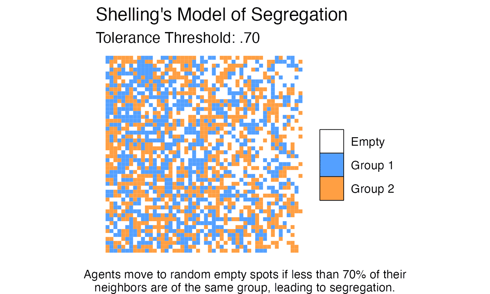

# Shelling's Model of Segregation

Shelling's Segregation Model is demonstrates how small-scale individual preferences can lead to large-scale societal segregation. The model was introduced by Thomas Schelling in his 1971 paper ["Dynamic Models of Segregation" (Journal of Mathematical Sociology)](https://www.tandfonline.com/doi/abs/10.1080/0022250X.1971.9989794).

It's an agent-based model, where agents (representing individuals or families) of two different types (e.g., races, religions) inhabit a grid. They prefer to move if less than a certain proportion of their neighbors are of the same type, leading to emergent segregation over time.

### Code & Results 

I was interested in writing up some simple R code that would enable the simulation of Shelling's model and animate the results. 

The output is rendered to static image files and rendered to mp4 and gif format using ImageMagick and ffmpeg. (I tried using the gifski package, but I didn't think the results were as nice.)

### My Caveats 

I think it's worth noting here that I think a substantial fraction of segregation *is* structural and not due to individual preferences.  We know that the US has a long history of redlining [1](https://ncrc.org/holc-health/), [2](https://www.theguardian.com/us-news/2022/mar/09/redlining-air-pollution-us-cities), [Jim Crow](https://en.wikipedia.org/wiki/Jim_Crow_laws) and slavery, and [the racial segregation of American cities was anything but accidental](https://www.smithsonianmag.com/history/how-federal-government-intentionally-racially-segregated-american-cities-180963494/). 

The point of writing this code and animating it isn't to advocate for the beliefs and assumptions posited within Shelling's model, but rather to a) share code of b) a relatively simple spatial (pixel-based) agent-based model, that can be c) animated for the benefit of folks interested in rendering these kinds of animations and to hone my skills. 

### Interesting Relevant Literature

These are just some interesting articles that caught my eye. 

  1. Shelling's Model on Wikipedia: <https://en.wikipedia.org/wiki/Schelling%27s_model_of_segregation>
  2. Dynamics of Segregation, Shelling (1971) <https://www.tandfonline.com/doi/abs/10.1080/0022250X.1971.9989794>
  3. Understanding the Social Context of Shelling's Model <https://www.pnas.org/doi/10.1073/pnas.0708155105>
  4. The Statistical Physics of Shelling's Model <https://en.wikipedia.org/wiki/Schelling%27s_model_of_segregation>
  5. The Schelling Model of Ethnic Residential Dynamics <https://www.jasss.org/15/1/6.html>
  6. Tipping and Residential Segregation: A Unified Shelling Model <https://onlinelibrary.wiley.com/doi/abs/10.1111/j.1467-9787.2010.00671.x>
  7. A Physical Analogue to the Shelling Model <https://www.pnas.org/doi/epdf/10.1073/pnas.0609371103>
